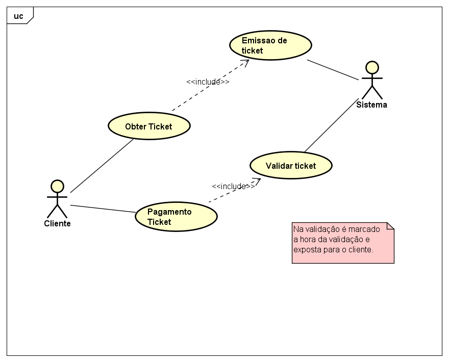
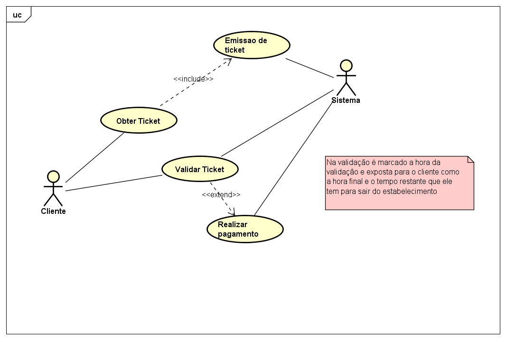

# EstacionaT
Sistema de estacionamento, criado para tratar problema percebido na validação de tickets de estacionamento de alguns sistemas.

#Problema
Sistema realiza a a emissão dos tickets de estacionamento com a data/hora de entrada, sendo esta a razão para determinar se o ticket tem que ser pago ou não, pois para permanencia inferior a 15 minutos nos estabelecimentos são livres de pagamento. Assim sendo, caso o cliente entre as 9:00 no estacionamento, e termine seus afazeres às 9:12 (nãom sendo possivel realizar o pagamento/validação de tickets que ainda nao tenham atingido o tempo de cobrança minimo que é de 15 minutos), teria que pagar rapidamente seu ticket antes de 9:15 para não ser cobrado, ou entao se for tentar chegar na cancela para sair do estacionamento em menos 3 minutos e não conseguir por alguma razão, terá o transtorno de ter que voltar aos caixas para realizar o pagamento e voltar para as cancelas.

#Solução
Incluir a validação do ticket na saida de qualquer forma. Mesmo chegando as 9:14 para fazer o pagamento ele realiza a validação do ticket, caso nao exista a necessidade de pagar (por nao ter atingido o tempo minimo) é incluido a validação no ticket, que assim para os maiores tempos, lhe garante 15 minutos(tempo variavel para condições de transito interno) para saida nas cancelas .

Sistema atual:

Sistema modificado para solucionar o problema:

